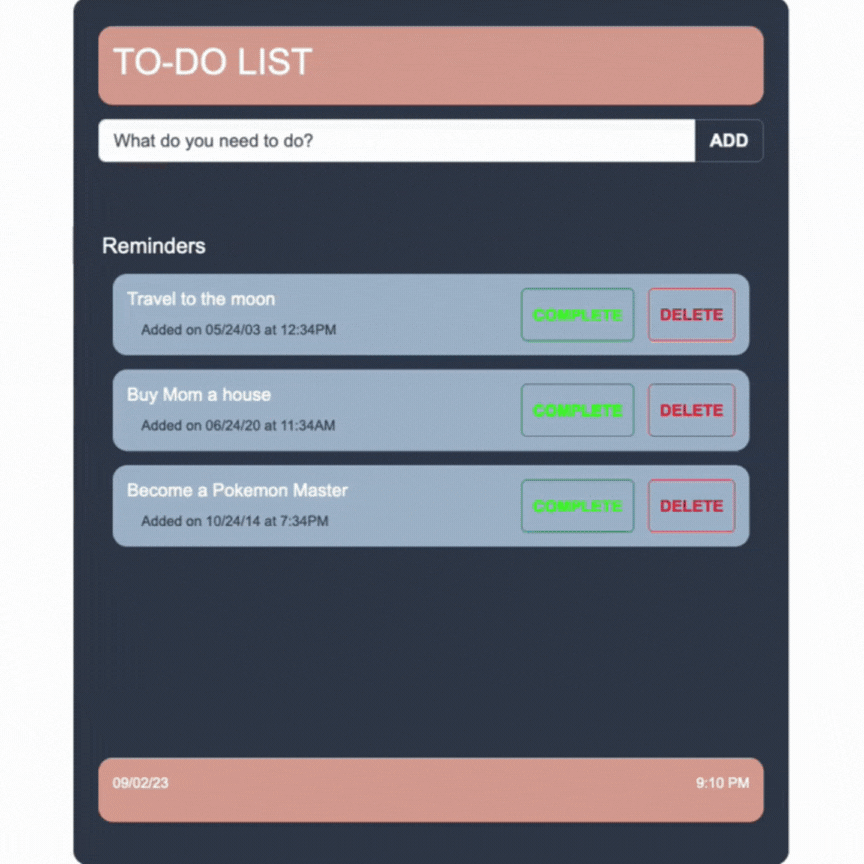

# Full Stack To-Do List:

## Description

_Duration: 18 hour Sprint_

Over the course of a weekend, the goal was to create a functional full-stack web based application. The web based application allow users to create and maintain a To-Do list. 

## Screen Shots
Preview:

GIF showing application features:

## Description & Approach

In order to tackle all the requirements for this project, I created a step-by-step plan that I felt best could fulfill all the requirements in the project. Additionally, each step could represent a branch that I could merge into the main once I have completed the necessary task. I also created a flowchart that allowed me to view the full scope of what I needed to create.

### Prerequisites
- [Node.js](https://nodejs.org/en/)
- Express 
- Body-Parser
- 'PG'
- Database Manager

## Installation
1. Clone this repository for your own access.
2. Open up your editor of choice and run `npm install`
3. Using your preferred database manager. Use the provided SQL file to set up the database as well as insert dummy data if needed. 
4. Run `npm start` in your terminal.
5. Navigate to http://localhost:5000/

## Usage
This web application is meant to assist the user by creating a to-do list:
 1. Using the provided input field, enter the task needed to add the to-do list.
 2. Using the add button will add the task and the current date and time to the to-do list.
 3. Using the complete button, the user can mark a task as completed as well as record the date and time the task was completed.
 4. Using the delete button, the user can delete any task that they no longer need on the to-do list.

## Acknowledgement
Thanks to [Prime Digital Academy](www.primeacademy.io) who equipped and helped me to make this application a reality.

## Support
If you have suggestions or issues, please email me at [paulhoanglong@gmail.com](www.google.com)